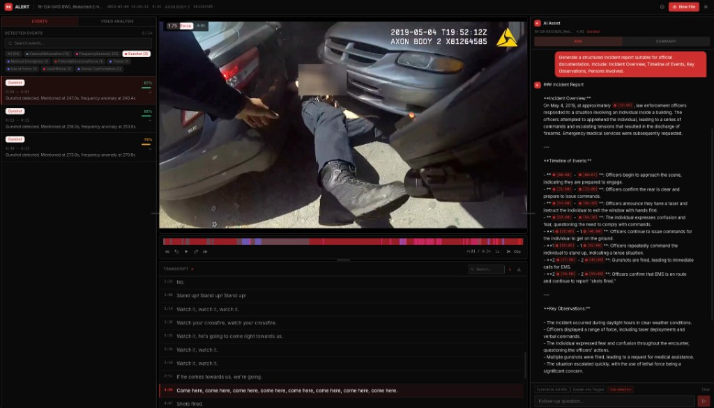
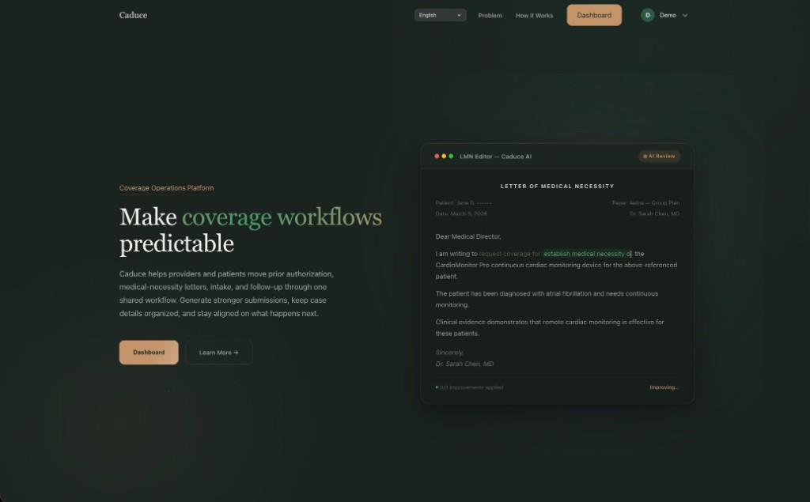
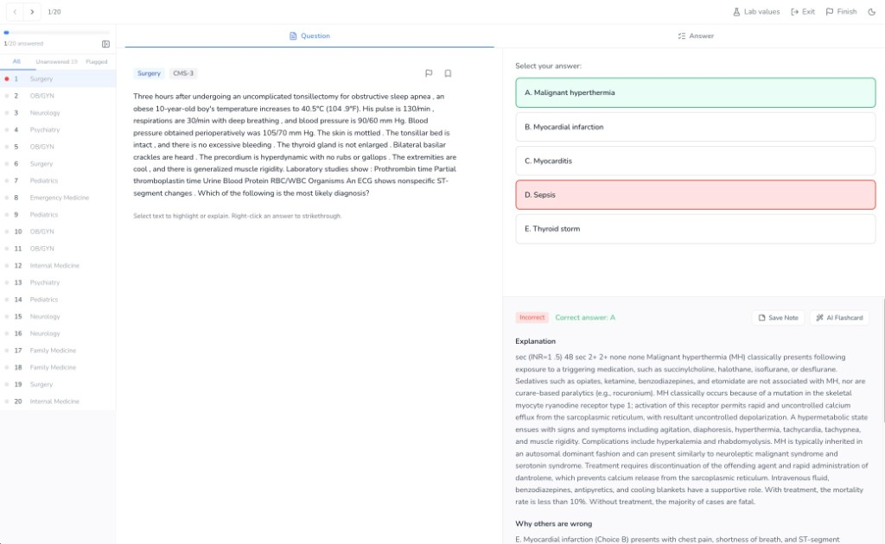
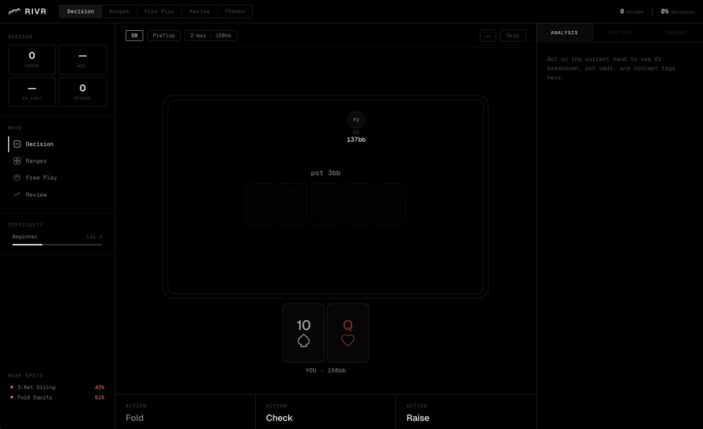

  

  
<code>CS @ Stanford, building things.</code>

  <a href="https://www.mariosumali.com"><code>mariosumali.com</code></a>&nbsp;&nbsp;&middot;&nbsp;&nbsp;<a href="mailto:msumali@stanford.edu"><code>msumali@stanford.edu</code></a>&nbsp;&nbsp;&middot;&nbsp;&nbsp;<a href="https://www.linkedin.com/in/mariosumali/"><code>LinkedIn</code></a>&nbsp;&nbsp;&middot;&nbsp;&nbsp;<a href="https://github.com/mariosumali"><code>GitHub</code></a>

<!--
---

### `RECENT`

<table>
<tr>
<td width="50%" valign="top">

 
<strong>ALERT</strong> &mdash; Investigation workspace for body cam and dash cam footage. Whisper transcription, audio event detection, multimodal AI analysis.
 
<code>React</code> <code>FastAPI</code> <code>Whisper</code> <code>Gemini</code> <code>GPT-4o</code>
 
<a href="https://github.com/mariosumali/ALERT"><code>GitHub</code></a>&nbsp;&middot;&nbsp;<a href="https://www.youtube.com/watch?v=qM6ZRfXLaUo"><code>Demo</code></a>
</td>
<td width="50%" valign="top">

 
<strong>Caduce</strong> &mdash; Coverage operations platform for healthcare. AI-drafted prior auth, medical necessity letters, and shared case tracking.
 
<code>Healthcare</code> <code>AI</code> <code>Full-stack</code>
 
<a href="https://www.caduce.org/"><code>Website</code></a>
</td>
</tr>
<tr>
<td width="50%" valign="top">

 
<strong>Chiron</strong> &mdash; Adaptive USMLE Step 2 CK prep. Custom question sets, progress tracking, and performance analytics.
 
<code>Medical education</code> <code>Adaptive learning</code> <code>Next.js</code>
 
<a href="https://chiron-frontend.vercel.app/"><code>Live app</code></a>
</td>
<td width="50%" valign="top">

 
<strong>Rivr</strong> &mdash; Math-first poker decision trainer. Procedural game states, EV-grounded feedback, and concept-tagged analytics.
 
<code>React</code> <code>Zustand</code> <code>Express</code> <code>Monte Carlo</code>
 
<a href="https://github.com/mariosumali/rivr"><code>GitHub</code></a>
</td>
</tr>
</table>

---
-->

 

  
  &nbsp;&nbsp;
  

